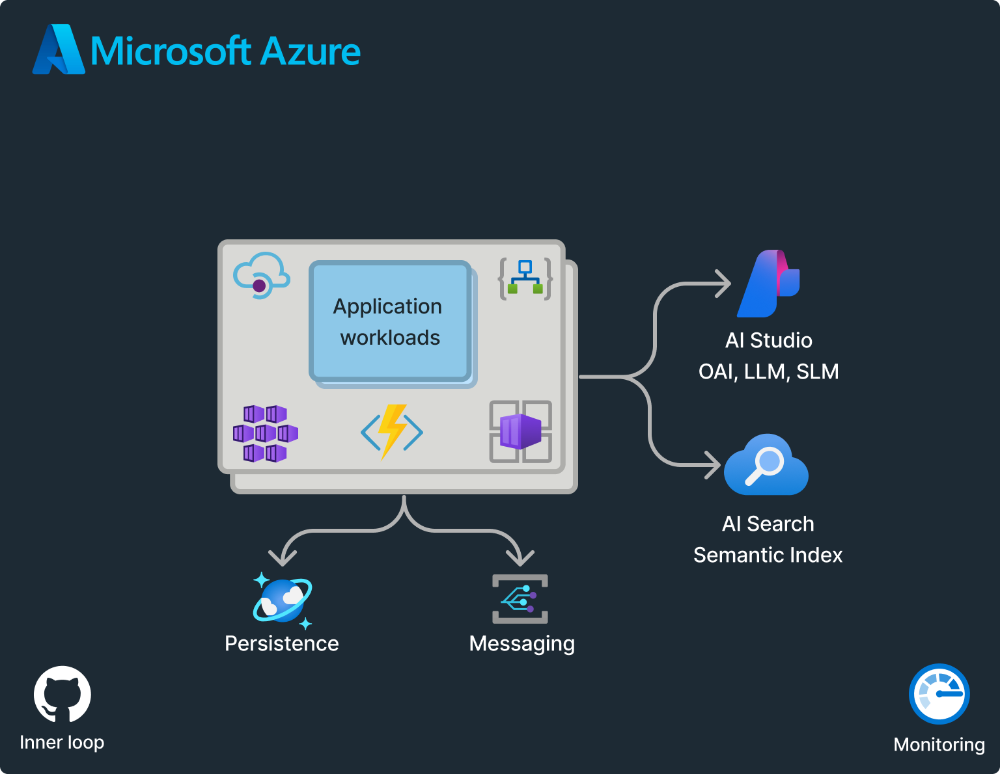
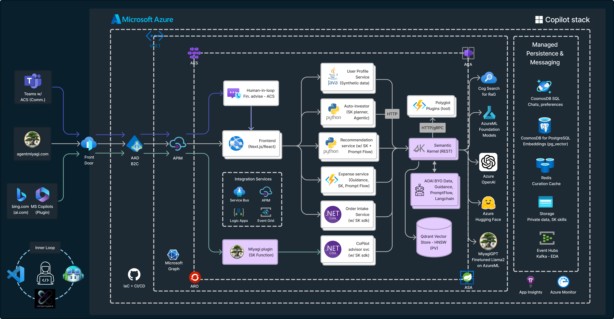
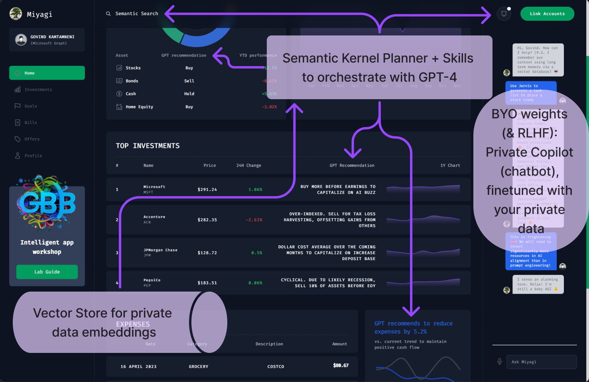

# Intelligent app workshop

This is an envisioning workshop, based on [Microsoft's Copilot stack](https://learn.microsoft.com/en-us/semantic-kernel/overview/#semantic-kernel-is-at-the-center-of-the-copilot-stack), to rethink user experience, architecture, and app development by leveraging the intelligence of foundation models. This comprehensive workshop utilizes the [Miyagi](https://github.com/Azure-Samples/miyagi) codebase and Semantic Kernel (SK), along with SK's Design thinking material, to guide you through the entire lifecycle of app development – from identifying user needs to deploying a fully functional, production-grade app on Azure.

> **Note**  
> *Work in Progress*. Meanwhile, signup at [intelligentapp.dev](https://intelligentapp.dev) for updates and checkout our related repo that showcases Generative AI capabilities for cloud-native, event-driven microservices: [Azure/reddog-solutions](https://github.com/Azure/reddog-solutions#readme). As a mandatory pre-requisite, please signup for [Azure OpenAI (AOAI)](https://customervoice.microsoft.com/Pages/ResponsePage.aspx?id=v4j5cvGGr0GRqy180BHbR7en2Ais5pxKtso_Pz4b1_xUOFA5Qk1UWDRBMjg0WFhPMkIzTzhKQ1dWNyQlQCN0PWcu) and complete [Getting started with AOAI module](https://learn.microsoft.com/en-us/training/modules/get-started-openai/) to benefit from this workshop
>
> :tv: For a preview, catch the [recording on Cosmos DB Live TV](https://www.youtube.com/watch?v=V8dlEvXdGEM&t=144s)
>
> 

 

Key takeaways:

1. Uncover innovative ways to transform user experience and app design by integrating foundation models into interactions.
2. Learn how to effectively harness Large Language Models (LLMs) with the [Miyagi](https://github.com/Azure-Samples/miyagi) codebase for streamlined development.
3. Rethink how to serve your end-user needs with Semantic Kernel's Design Thinking workshop.
4. Gain valuable insights into the production and deployment of apps powered by Large Language Models (LLMs).

### Disclaimer

This software is provided for demonstration purposes only. It is not intended to be relied upon for any purpose. The creators of this software make no representations or warranties of any kind, express or implied, about the completeness, accuracy, reliability, suitability or availability with respect to the software or the information, products, services, or related graphics contained in the software for any purpose. Any reliance you place on such information is therefore strictly at your own risk.

### License

This software is provided for demonstration purposes only. It is not intended to be relied upon for any purpose. The software is provided “as is” and without any warranties, express or implied. The software is not intended to be used for any commercial purpose. The software is provided solely for demonstration purposes and should not be used for any other purpose. The software is provided without any warranty of any kind, either express or implied, including, but not limited to, the implied warranties of merchantability, fitness for a particular purpose, or non-infringement. The software is provided “as is” and without any warranty of any kind. The user assumes all risk and responsibility for the use of the software.