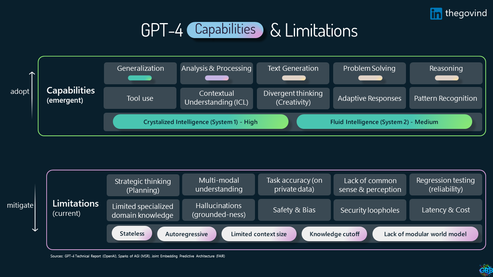

# Introduction

Welcome to the Intelligent App Development Workshop! In this hands-on workshop, we will explore how to incorporate AI, particularily Large Language Models (LLMs) and state-of-the-art (SoTA) multi-modal foundation models such as Dall-E and Stable Diffusion, into every aspect of your app, transforming traditional processes and simplifying the overall architecture.

[Sign up for updates](https://forms.office.com/r/rLds2s8RH1){ :target="_blank" .md-button .md-button--primary }

## Overview

We will take a methodical approach, starting slow and building concepts with a DIY (Do It Yourself) mindset. This workshop covers a wide range of topics, including the latest frameworks, approaches, and architectures in AI-driven app development, in addition to production-grade deployment options on Azure. We will begin by identifying customer needs and then work backwards to determine how these new technologies can address those needs by integrating AI into every step of the process.

### Who is this for

This workshop is designed for:

- Developers and Architects with a basic understanding of app development who want to incorporate AI into their apps
- Product managers and designers interested in leveraging AI to improve user experiences
- Anyone curious about the potential of AI in app development
