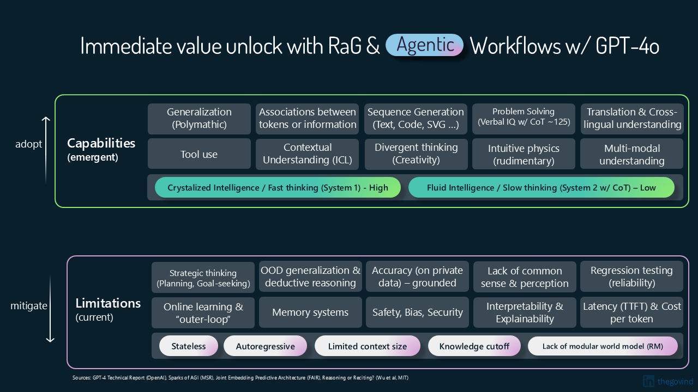

# Introduction

In this hands-on workshop, we will explore how to use Microsoft's Copilot Stack to develop your own AI-infused, enterprise-grade applications that improve productivity and create hyper-personalized product experiences.

We will also highlight the emergent capabilities that are advantageous to adopt, as well as the limitations that can be mitigated through engineering, particularly in the areas of orchestration and retrieval. Additionally, we will showcase the capabilities within the Copilot Stack that enable you to achieve this.

## Overview

This workshop offers a methodical, hands-on approach that starts with the basics and gradually introduces you to advanced capabilities. It covers a broad range of topics, including the latest frameworks, methodologies, and architectures in AI-driven app development, along with production-grade deployment options on Azure. We will begin with Azure AI Foundry and Prompt Flow to demonstrate how easy it is to get started. From there, we will dive deeper into SDK-based development, utilizing AI orchestration libraries (Semantic Kernel, Langchain, Llamaindex) integrated with Azure AI's LLMOps tooling, the multi-agent framework with AutoGen with Assistants API, and advanced retrieval systems using GraphRag. Once you are well-versed in these capabilities, the next step is to identify customer needs and work backwards to determine how these technologies can be integrated into the development process to address those needs effectively.

### Who is this for

This workshop is designed for:

- Developers and Architects with a foundational understanding of app development who want to incorporate AI into their applications.
- Product managers and designers interested in leveraging AI to enhance user experiences.
- Anyone curious about the potential of AI in app development.

### Disclaimer

This software is provided for demonstration purposes only. It is not intended to be relied upon for any purpose. The creators of this software make no representations or warranties of any kind, express or implied, about the completeness, accuracy, reliability, suitability or availability with respect to the software or the information, products, services, or related graphics contained in the software for any purpose. Any reliance you place on such information is therefore strictly at your own risk.

### License

This software is provided for demonstration purposes only. It is not intended to be relied upon for any purpose. The software is provided “as is” and without any warranties, express or implied. The software is not intended to be used for any commercial purpose. The software is provided solely for demonstration purposes and should not be used for any other purpose. The software is provided without any warranty of any kind, either express or implied, including, but not limited to, the implied warranties of merchantability, fitness for a particular purpose, or non-infringement. The software is provided “as is” and without any warranty of any kind. The user assumes all risk and responsibility for the use of the software.