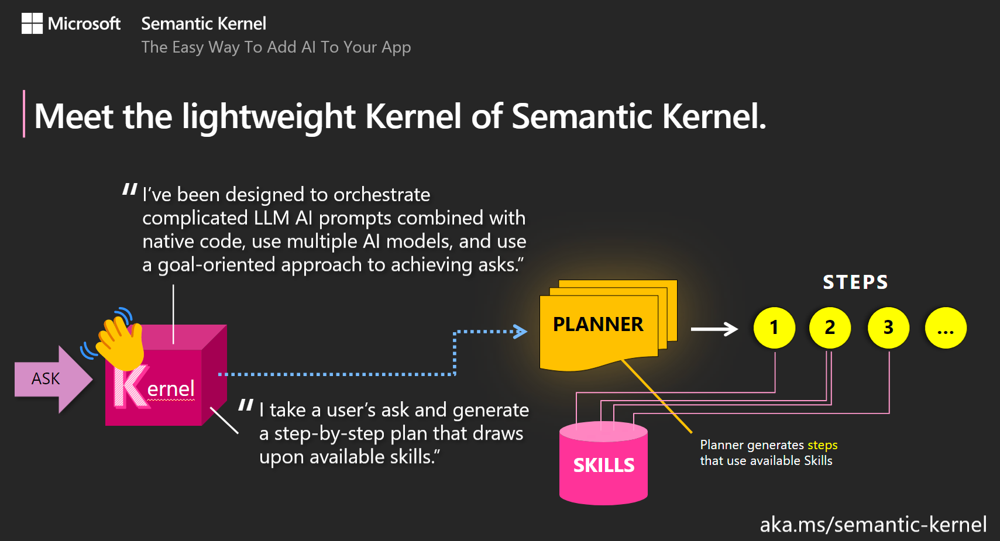

# Semantic Kernel Overview

Semantic Kernel (SK) is a lightweight SDK enabling integration of AI Large Language Models (LLMs) with conventional programming languages. The SK extensible programming model combines natural language semantic functions, traditional code native functions, and embeddings-based memory unlocking new potential and adding value to applications with AI.

SK supports prompt templating, function chaining, vectorized memory, and intelligent planning capabilities out of the box.

*[Source](https://github.com/microsoft/semantic-kernel#semantic-kernel)

## [Skills](https://github.com/microsoft/semantic-kernel/tree/main/samples/skills)

TODO: Sample skills notebooks video walkthrough