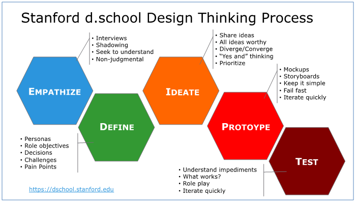

# Design Thinking Session with Semantic Kernel

In this module, we'll be using a Figma template to facilitate a design thinking session focused on identifying customer needs and pain points, and explore how AI-driven solutions can address them effectively. This will also ensure that the workshop is more relevant as we get more hands-on in the coming hours and days.

## Overview

1. Introduction to Design Thinking & HEART Framework
2. Understanding Semantic Kernel
3. Setting up the Figma Template
4. Design Thinking Activities
   - Empathize
   - Define
   - Ideate
   - Prototype
   - Test
5. Integrating AI and Semantic Kernel Skills
6. Conclusion and Next Steps

### Introduction to Design Thinking & HEART Framework

Design Thinking is a human-centered, iterative approach to problem-solving that focuses on deeply understanding users' needs and developing innovative solutions to address them. It consists of five stages: Empathize, Define, Ideate, Prototype, and Test.

The HEART framework is a methodology to improve the user experience (UX) of software. The framework helps a company evaluate any aspect of its user experience according to five user-centered metrics. These metrics, which form the acronym HEART, are:

1. Happiness
1. Engagement
1. Adoption
1. Retention
1. Task success

### Understanding Semantic Kernel

Semantic Kernel is a framework that helps developers build AI-driven applications by orchestrating and chaining AI skills. It allows for the seamless integration of AI components into the user experience and backend workflows.

### Setting up the Figma Template

1. Sign up for a free [Figma](https://www.figma.com/) account if you don't already have one.
2. Duplicate the provided Design Thinking template to your Figma workspace.
3. Invite your team members to collaborate on the template in real-time.

### Design Thinking Activities

#### Empathize

- Conduct user interviews, surveys, or observations to understand users' needs, motivations, and pain points.
- Create empathy maps and personas to represent different user segments.

#### Define

- Analyze and synthesize your findings to define the problem statement.
- Prioritize user needs and pain points to focus on the most critical issues.

#### Ideate

- Generate a wide range of ideas to address the defined problem.
- Use brainstorming, mind mapping, or other ideation techniques to encourage creative thinking.

#### Prototype

- Create low-fidelity prototypes of your proposed solutions.
- Use wireframes, mockups, or simple interactive models to visualize the user experience.

#### Test

- Validate your prototypes with real users through usability testing, interviews, or other feedback mechanisms.
- Iterate on your designs based on user feedback and insights.

### Integrating AI and Semantic Kernel Skills

- Identify areas in your design where AI can add value, such as personalization, automation, or enhanced user experiences.
- Explore how Semantic Kernel skills can be integrated into your solution to enable AI-driven features and capabilities.

### Conclusion and Next Steps

- Reflect on the insights gained through the design thinking process and how they can inform your application's development.
- Plan the next steps for implementing your AI-infused solution using Semantic Kernel and other AI technologies.

By completing this module, you will have a deeper understanding of your users' needs and pain points and a solid foundation for incorporating AI-driven solutions into your application using Semantic Kernel.

