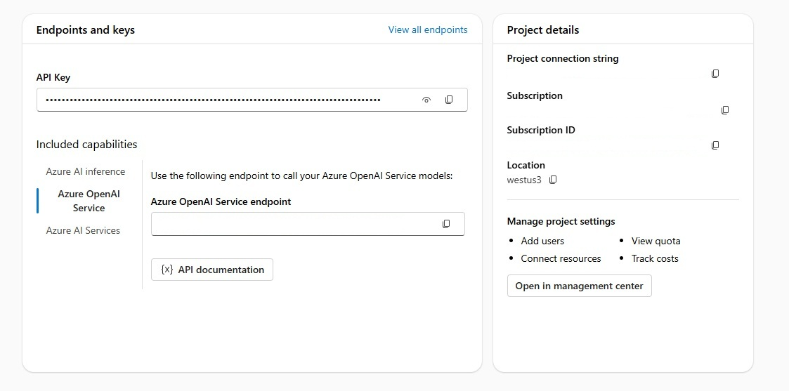
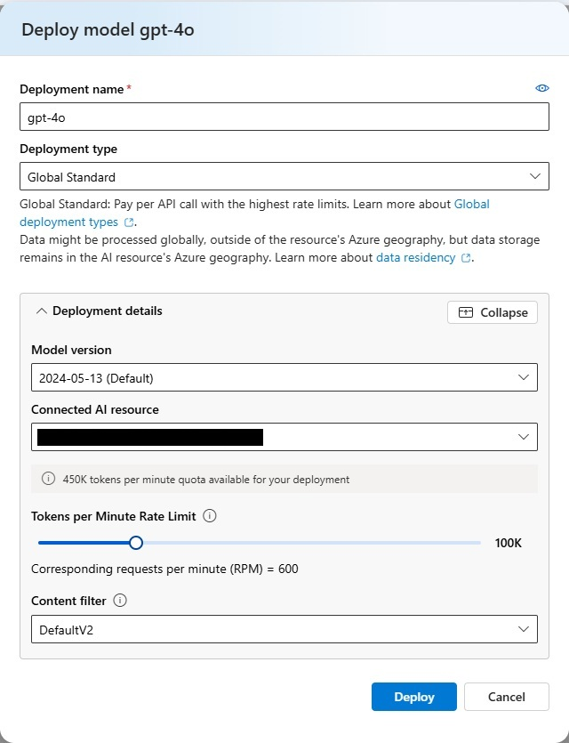
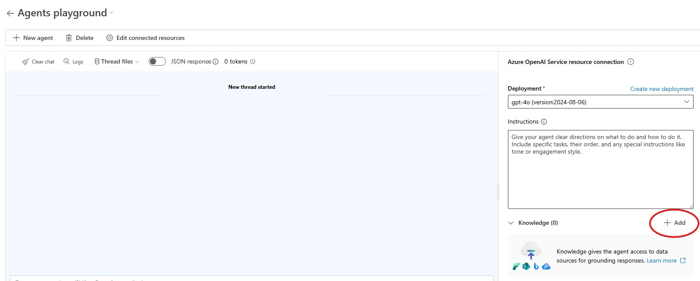

# Prerequisites

Before attending the Intelligent App Development Workshop, please ensure you have the following prerequisites in place:

1. **Azure account**: A Microsoft Azure account with an active subscription. If you don't have one, sign up for a [free trial](https://azure.microsoft.com/en-us/free/).
1. **Azure subscription with access enabled for the Azure AI Foundry** - For more details, see the [Azure AI Foundry documentation on how to get access](https://learn.microsoft.com/en-us/azure/ai-studio/what-is-ai-studio#how-to-get-access). 

## Development Environment Setup

You have the option of using [Github Codespaces](https://docs.github.com/en/codespaces/getting-started/quickstart) or your local development environment.

### Using Github Codespaces (recommended)

If using Github Codespaces all prerequisites will be pre-installed, however you will need to create a fork as follows:

1. Navigate to this link to create a new [fork](https://github.com/Azure/intelligent-app-workshop/fork) (must be logged into your github account).
1. Accept the default values and click on **"Create fork"** which will take you to the forked repository in the browser.
1. From your forked repository click on the **"<> Code"** button. Then click on the **"Create codespace on main"** button.

### Using local development environment

If you prefer using a computer with using a local development environment, the following pre-requisites need to be installed:

1. **Git**: Ensure you have [Git](https://git-scm.com/downloads) installed on your computer.
1. **Azure CLI**: Install the [Azure Command-Line Interface (CLI)](https://docs.microsoft.com/en-us/cli/azure/install-azure-cli) to interact with Azure services and manage resources from the command line.
1. **.NET SDK**: install [.NET SDK](https://dotnet.microsoft.com/en-us/download) to build and run .NET projects.
1. **Docker**: Install [Docker Desktop](https://www.docker.com/products/docker-desktop) to build and run containerized applications.
1. **Node.Js**: Install [Node.Js](https://nodejs.org/en/download/package-manager) to build and run web application.
1. **Azure Development CLI**: Install [azd](https://learn.microsoft.com/en-us/azure/developer/azure-developer-cli/install-azd) to be able to provision and deploy application to Azure.
1. **bash/shell terminal**: the lessons assume bash/shell script syntax. If using Windows, either you can either using Git Bash (included when you install Git) or installing [WSL (Windows Subsystem for Linux)](https://learn.microsoft.com/en-us/windows/wsl/install).

Next you will need to clone this repo using:

```bash
git clone https://github.com/Azure/intelligent-app-workshop.git
```

Change directory into cloned repo:

```bash
cd intelligent-app-workshop
```

## Initial Setup

1. Copy and rename the file `appsettings.json.example` into the corresponding lesson directory as follows (example command for Lesson1):

    ```bash
    cp workshop/dotnet/Lessons/appsettings.json.example workshop/dotnet/Lessons/Lesson1/appsettings.json
    ```

1. Create Azure Grounding with Bing Search resource. We will use this to ensure the LLM can get current data from the internet:

    1. Create Bing Search Service (from Azure Portal):
        1. Go to the [Azure Portal](https://portal.azure.com).
        1. Click on [Create A Resource](https://ms.portal.azure.com/#create/hub)
        1. On the search bar type **Grounding with Bing Search** and hit enter
        1. Locate **Grounding with Bing Search** and click **Create**
        1. On the **Create a Grounding with Bing Search Resource** page, provide the following information for the fields on the Basics tab:
            * Subscription: The Azure subscription to used for your service.
            * Resource group: The Azure resource group to contain your Bing service resource. You can create a new group or use a pre-existing group.
            * Name: A descriptive and unique name for your Grounding with Bing Search Service resource, such as `grounding-bing-search-myid`.
            * Region: Global (default).
            * Pricing Tier: Grounding with Bing Search (default)
            * Terms: Check the box to acknowledge the terms of use.
        1. Click **Next**.
        1. On the **Tags** tab click **Next**
        1. Click **Create**.

1. Create an Azure AI Foundry Hub:

    1. Go to the [Azure Portal](https://portal.azure.com).
    1. Click on [Create A Resource](https://ms.portal.azure.com/#create/hub).
    1. On the search bar type **Azure AI Foundry** and hit enter.
    1. Locate **Azure AI Foundry** and click **Create**.
    1. On the **Create Azure AI Foundry Hub** page, provide the following information for the fields on the Basics tab:
        * Subscription: The Azure subscription to be used for your service.
        * Resource group: The Azure resource group to contain your Azure AI Foundry Hub service resource. For simplicity, use the same resource group you used for the Bing Search grounding resource.
        * Region: The location of your instance. Different locations can introduce latency, but they don't affect the runtime availability of your resource.
        * Name: A descriptive and unique name for your Azure AI Foundry Hub service resource, such as `aifoundryhub-sk-workshop-myid`.
    1. Click **Review + create**.
    1. Click **Create**.
    1. When the deployment is complete, click **Go to resource**
    1. Click **Launch Azure AI Foundry**

1. Create an Azure AI Foundry project:

    1. Click **New Project**
    1. Enter a name for your project
    1. Click **Create**

1. Store AI Foundry settings in `appsettings.json`
    1. In Azure AI Foundry, copy the API key and use it as the **apiKey** value in the `AIFoundryProject` element of `appsettings.json`.
    1. Under **Included capabilities** choose **Azure OpenAI Service** and copy the endpoint. Use it as the **endpoint** value in the `AIFoundryProject` element of `appsettings.json`.
    1. On the right side of the screen, locate the **Project connection string** (within **Project Details**) and use it as the **connectionString** value within the `AIFoundryProject` element in `appSettings.json`.
            

1. Deploy a model in Azure AI Foundry:

    1. Click the **Models + endpoints*** tab (sidebar, left) to view currently deployed models.
    1. If your desired model is not deployed, click on **Deploy Model** then select to **Deploy Base Model**.
    1. You will need a chat completion model. For this workshop we recommend using `gpt-4o`. Select `gpt-4o` from the drop down and click **Confirm**.
    1. Click **Customize** and choose the `2024-05-13` model. At the time of this workshop, this is the [latest version](https://learn.microsoft.com/en-us/azure/ai-services/agents/how-to/tools/bing-grounding?pivots=overview#setup) that integrates with Azure AI Agent Service, which we will use in Lesson 6.
    1. Adjust the Tokens per Minute Rate Limit to at least 250 requests per minute (RPM)
    1. Click **Deploy**.
        
    1. Use the **Deployment Name** value (e.g. gpt-4o) as the **deploymentName** value within the `AIFoundryProject` element in the `appsettings.json` file.
    1. Wait a few minutes after deployment to allow the API to come online.

1. Create Agents connection to Grounding with Bing Search resource:

    1. Click on **Playgrounds** on the left side.
    1. In the Agents playground box, click **Try the Agents playground**.
    1. Choose your Azure OpenAI Service instance in the dropdown and click **Let's go**.
    1. Scroll down and find the `Knowledge` section on the right. Click **Add**.
        
    1. Click **Grounding with Bing Search**.
    1. Click **Create connection**.
    1. Find the resource you created and click **Add connection**.
    1. Click **Connect**.
    1. From the Agents playground page, locate the **Knowledge** section and copy the name of the connection you just created and paste it as the **groundingWithBingConnectionId** value within the `AIFoundryProject` element in the `appSettings.json` file.

1. Additionally, we need to obtain an API Key to be able to get stock prices from [polygon.io](https://polygon.io/dashboard/login). You can sign up for a free API Key by creating a login. This value will be needed for [Lesson 3](lesson3.md).
    1. Once logged in, from the [polygon.io Dashboard](https://polygon.io/dashboard) locate the **Keys** section. Copy the default key value and paste it as the **apiKey** value within the `StockService` element in the `appsettings.json` file.

By ensuring you have completed these prerequisites, you'll be well-prepared to dive into the Intelligent App Development Workshop and make the most of the hands-on learning experience.
