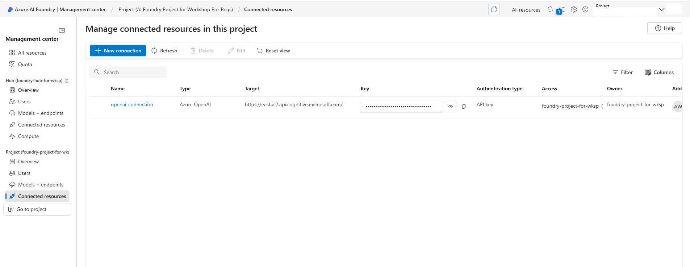
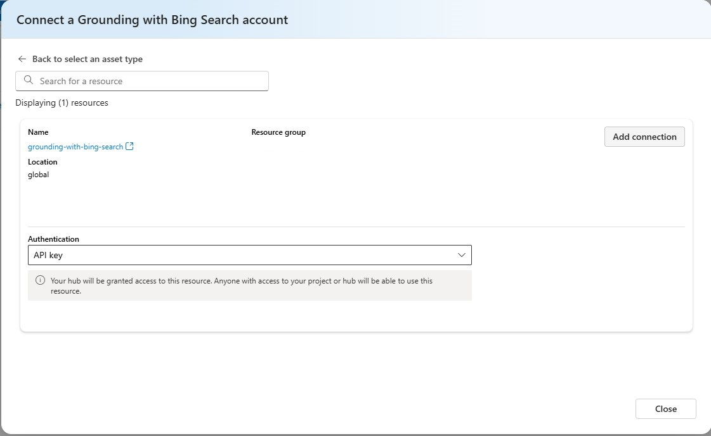

# Prerequisites

Before attending the Intelligent App Development Workshop, please ensure you have the following prerequisites in place:

1. **Azure account**: A Microsoft Azure account with an active subscription. If you don't have one, sign up for a [free trial](https://azure.microsoft.com/en-us/free/).
1. **Azure subscription with access enabled for the Azure AI Foundry** - For more details, see the [Azure AI Foundry documentation on how to get access](https://learn.microsoft.com/en-us/azure/ai-studio/what-is-ai-studio#how-to-get-access). 

## Development Environment Setup

You have the option of using [Github Codespaces](https://docs.github.com/en/codespaces/getting-started/quickstart) or your local development environment.

### Using Github Codespaces (recommended)

If using Github Codespaces all prerequisites will be pre-installed, however you will need to create a fork as follows:

1. Navigate to this link to create a new [fork](https://github.com/Azure/intelligent-app-workshop/fork) (must be logged into your github account).
1. Accept the default values and click on **"Create fork"** which will take you to the forked repository in the browser.
1. From your forked repository click on the **"<> Code"** button. Then click on the **"Create codespace on main"** button.

### Using local development environment

If you prefer using a computer with using a local development environment, the following pre-requisites need to be installed:

1. **Git**: Ensure you have [Git](https://git-scm.com/downloads) installed on your computer.
1. **Azure CLI**: Install the [Azure Command-Line Interface (CLI)](https://docs.microsoft.com/en-us/cli/azure/install-azure-cli) to interact with Azure services and manage resources from the command line.
1. **.NET SDK**: install [.NET SDK](https://dotnet.microsoft.com/en-us/download) to build and run .NET projects.
1. **Docker**: Install [Docker Desktop](https://www.docker.com/products/docker-desktop) to build and run containerized applications.
1. **Node.Js**: Install [Node.Js](https://nodejs.org/en/download/package-manager) to build and run web application.
1. **Azure Development CLI**: Install [azd](https://learn.microsoft.com/en-us/azure/developer/azure-developer-cli/install-azd) to be able to provision and deploy application to Azure.
1. **bash/shell terminal**: the lessons assume bash/shell script syntax. If using Windows, either you can either using Git Bash (included when you install Git) or installing [WSL (Windows Subsystem for Linux)](https://learn.microsoft.com/en-us/windows/wsl/install).

Next you will need to clone this repo using:

```bash
git clone https://github.com/Azure/intelligent-app-workshop.git
```

Change directory into cloned repo:

```bash
cd intelligent-app-workshop
```

1. Create Azure Grounding with Bing Search resource. We will use this to ensure the LLM can get current data from the internet:

    1. Create Grounding with Bing Search resource (from Azure Portal):
        1. Go to the [Azure Portal](https://portal.azure.com).
        1. Click on [Create A Resource](https://ms.portal.azure.com/#create/hub)
        1. On the search bar type **Grounding with Bing Search** and hit enter
        1. Locate **Grounding with Bing Search** and click **Create**
        1. On the **Create a Grounding with Bing Search Resource** page, provide the following information for the fields on the Basics tab:
            * Subscription: The Azure subscription to used for your service.
            * Resource group: Select the resource group created by the prerequisites stack
            * Name: A descriptive and unique name for your Grounding with Bing Search Service resource, such as `grounding-bing-search-myid`.
            * Region: Global (default).
            * Pricing Tier: Grounding with Bing Search (default)
            * Terms: Check the box to acknowledge the terms of use.
        1. Click **Next**.
        1. On the **Tags** tab click **Next**
        1. Click **Create**.

1. Create Agents connection to Grounding with Bing Search resource:

    1. Go to the Azure AI Foundry (https://ai.azure.com/) and choose your project
    1. Scroll down on the left side and click **Management Center**.
    1. On the left side click **Connected Resources**.
    1. You will see that the bicep template deployed an OpenAI resource and connected it to your Foundry project.
    1. Click **New Connection**
        
    1. Scroll down and choose **Grounding with Bing Search**.
    1. Click **Create connection**.
        
    1. Find the resource you created and click **Add connection**.
    1. Click **Close**.
    1. On the Connections page, copy the name of the connection you just created and paste it as the **groundingWithBingConnectionId** value within the `AIFoundryProject` element in the `appSettings.json` file.

1. Upgrade OpenAI Connection

    1. The OpenAI connection needs to be upgraded to allow you to see your deployed model. On the Connections page, click on your Open AI connection.
    1. Click **Upgrade Connection**
        
    1. On the left, click **Models + Endpoints** and you should see your `gpt-4o` deployment. If you need to adjust settings on it at a later time, this is where you can find it.

## Initial Setup

1. Copy and rename the file `appsettings.json.example` into the corresponding lesson directory as follows (example command for Lesson1):

    ```bash
    cp workshop/dotnet/Lessons/appsettings.json.example workshop/dotnet/Lessons/Lesson1/appsettings.json
    ```
1. Deploy Pre-requisite resource template

    1. In your cli, go to the `/workshop/pre-reqs/` directory and run  `az login`
    1. Run `azd provision -e my-environment`, replacing the environment name with your desired name.
    1. Choose the appropriate subscription and location. `eastus2` is recommended.

1. Store AI Foundry settings in `appsettings.json`
    1. In Azure AI Foundry main project page, copy the connection string and use it as the **connectionString** value in the `AIFoundryProject` element of `appsettings.json`.
    1. Under **My Assets** choose **Models + Endpoints**. Next to the `gpt-4o` deployment, click `Get Endpoint`. Copy the endpoint and store it as **endpoint** value in the `AIFoundryProject` element of `appsettings.json`. Copy the api key and store as the **apiKey** value in `appsettings.json`.
            

1. We need to obtain an API Key to be able to get stock prices from [polygon.io](https://polygon.io/dashboard/login). You can sign up for a free API Key by creating a login. This value will be needed for [Lesson 3](lesson3.md).
    1. Once logged in, from the [polygon.io Dashboard](https://polygon.io/dashboard) locate the **Keys** section. Copy the default key value and paste it as the **apiKey** value within the `StockService` element in the `appsettings.json` file.

By ensuring you have completed these prerequisites, you'll be well-prepared to dive into the Intelligent App Development Workshop and make the most of the hands-on learning experience.
