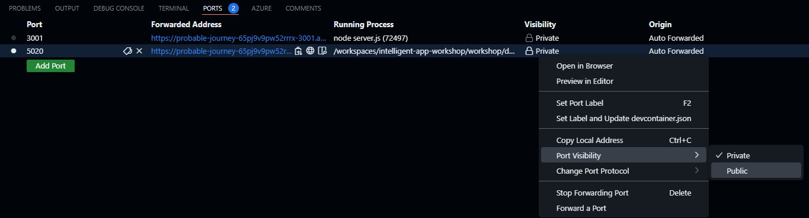

# Creating simple Web UI

The UI was created using React JS and a Node JS proxy to the API. Here is a highlight of key files:

* `workshop/frontend`
  * `Dockerfile` - Dockerfile for building and deploying web app
  * `.env` - local file used to provide configuration values (e.g. url)
  * `package.json` - required package dependencies
  * `server.js` - NodeJS application code
  * `src` - React JS application source code directory
    * `App.tsx` - main application code
    * `index.tsx` - application entry point

## Running Web UI locally

### Build Web UI

1. Go to the frontend directory

   ```bash
   cd workshop/frontend
   ```

1. Run `npm install` to get required dependencies

1. Run `npm run build` to build the React application

### Run Web UI

1. Create `.env` file in `frontend` directory and provide the following required values:
    1. `PORT` - port where React app is running
    1. `REACT_APP_PROXY_URL` - url to the Node JS proxy

    ```shell
    export PORT=3001
    export REACT_APP_PROXY_URL=/api/chat
    ```

1. On a separate terminal export the following required variables for NodeJS proxy application
   (note `API_URL` will be different if using Github Codespace, e.g. `https://awesome-journey-65pj9v9pw52rrrx-5020.app.github.dev/chat`):

    ```bash
    export PORT=3001
    export API_URL=http://localhost:5000/chat
    ```

    1. From `workshop/frontend` directory start the NodeJS proxy application using `node server.js`

1. On a separate terminal start backend API using:

    ```bash
    cd workshop/dotnet/App/backend/
    dotnet run
    ```

    1. If testing from GitHub Codespace, the port forwarded for .NET application must have a port visibility of Public:
        1. To change this, click on the **PORTS** tab in Visual Studio Code and then right click running .NET application row and hover over **Port Visibility** and click **Public**
           and click on **Public**
           

1. Navigate to browser on <http://localhost:3001> or forwarded address (if using Github Codespace) and test the chat application.
