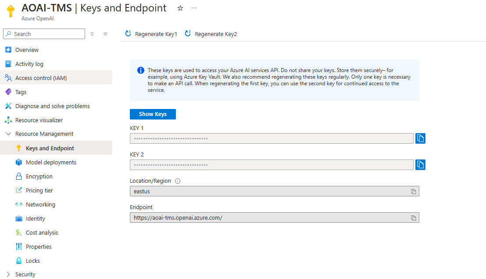
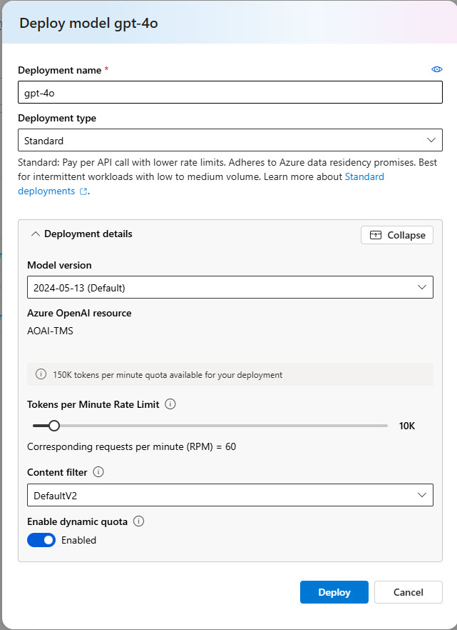

# Prerequisites

Before attending the Intelligent App Development Workshop, please ensure you have the following prerequisites in place:

1. **Basic programming knowledge**: Familiarity with at least one programming language (e.g., Python, JavaScript, Java, or C#) and basic understanding of software development concepts.
1. **Azure account**: A Microsoft Azure account with an active subscription. If you don't have one, sign up for a [free trial](https://azure.microsoft.com/en-us/free/).
1. **Azure subscription with access enabled for the Azure OpenAI Service** - For more details, see the [Azure OpenAI Service documentation on how to get access](https://learn.microsoft.com/azure/ai-services/openai/overview#how-do-i-get-access-to-azure-openai). 
1. **Azure OpenAI resource** - For this workshop, you'll need to deploy at least one model such as GPT 4. See the Azure OpenAI Service documentation for more details on [deploying models](https://learn.microsoft.com/azure/ai-services/openai/how-to/create-resource?pivots=web-portal) and [model availability](https://learn.microsoft.com/azure/ai-services/openai/concepts/models).
1. **Development environment**: A computer with your preferred development environment installed, such as Visual Studio Code, PyCharm, or another IDE that supports the programming language you'll be using in the workshop.
1. **Git**: Familiarity with Git and GitHub for version control. Ensure you have [Git](https://git-scm.com/book/en/v2/Getting-Started-Installing-Git) installed on your computer.
1. **Azure CLI**: Install the [Azure Command-Line Interface (CLI)](https://docs.microsoft.com/en-us/cli/azure/install-azure-cli) to interact with Azure services and manage resources from the command line.
1. **.NET CLI**: .NET CLI is included when you install [.NET SDK](https://dotnet.microsoft.com/en-us/download)
1. **Docker**: Install [Docker Desktop](https://www.docker.com/products/docker-desktop) to build and run containerized applications.

## Initial Setup

1. Ensure all [pre-requisites](pre-reqs.md) are met and installed.
2. Clone this repo using:

    ```bash
    git clone https://github.com/Azure/intelligent-app-workshop.git
    ```

3. Change directory into cloned repo:

    ```bash
    cd intelligent-app-workshop
    ```

4. Copy and rename the file `appsettings.json.example` into the corresponding lesson directory as follows (example command for Lesson1):

    ```bash
    cp workshop\dotnet\Lessons\appsettings.json.example workshop\dotnet\Lessons\Lesson1\appsettings.json
    ```

5. Retrieve the OpenAI Endpoint URL, API Key and deployed model name then update newly created appsettings.json

    1. Get Azure OpenAI access values: From Portal:

        The Azure OpenAI endpoint and key values will be found in the [Azure Portal](https://portal.azure.com) so let's start there.
        1. Go to the [Azure Portal](https://portal.azure.com).
        1. Go to the Azure OpenAI resource.
        1. Expand the **Resource Management** section in the sidebar (menu at left)
        1. Click the **Keys and Endpoint** option.
        1. Click **Show Keys** - you should see the following: KEY 1, KEY 2 and Endpoint.
        1. Use the **KEY 1** value for **apiKey** in appsettings.json under OpenAI.
        1. Use the **Endpoint** value for **endpoint** in appsettings.json under OpenAI.

        

        Next, we need to create deployments from the Azure OpenAI models.

        1. Click the **Model deployments** option in the sidebar (left menu) for Azure OpenAI resource.
        1. In the destination page, click **Manage Deployments**
        1. (Optional) You can directly navigate to the [Azure OpenAI Studio website](https://oai.azure.com).

        This will take you to the Azure OpenAI Studio website, where we'll find the other values as described below.

    1. Get Azure OpenAI deployments: From Studio

        1. Navigate to [Azure OpenAI Studio](https://oai.azure.com) **from your resource** as described above.
        1. Click the **Deployments** tab (sidebar, left) to view currently deployed models.
        1. If your desired model is not deployed, use **Create new deployment** to deploy it. If using the new portal, use **Deploy model** button.
        1. You will need a chat completion model (gpt-4o model or similar)- deploy the model
        1. Update appsettings.json deploymentName field with your model deployment name.

        

By ensuring you have completed these prerequisites, you'll be well-prepared to dive into the Intelligent App Development Workshop and make the most of the hands-on learning experience.
