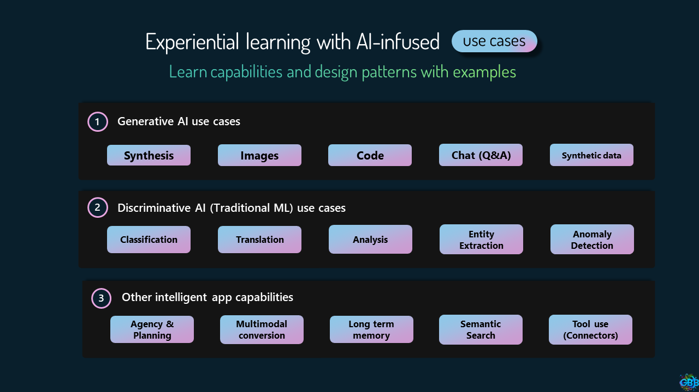

# Deep-Dive into AI Use-Cases 

In this module, we will undertake a comprehensive exploration of [Project Miyagi](https://github.com/Azure-Samples/miyagi) and the [Reddog](https://github.com/Azure/reddog-solutions) codebase. This deep dive will highlight a range of use-cases that can be adopted into your own applications, thereby enabling you to infuse AI technologies to address the diverse needs of your end users.

??? tip
    For detailed implementation of the use-cases, see [miyagi/services](https://github.com/Azure-Samples/miyagi/tree/main/services)

## Use Cases

1. [Synthesis](./synthesis.md): Learn how information is synthesized in Miyagi to generate insights, orchestrated by Semantic Kernel.
1. [Multi-modal Generation](./generation.md): Discover how Generative AI is used in Miyagi and Reddog to generate text, images, and videos.
1. [Conversation](./generation.md): Deep-dive into how Miyagi Chatbot is built using Semantic Kernel's Copilot Chat, which you can leverage to build your own Copilot.
1. [Summarization](./generation.md): Understand how to create TL/DRs in your apps using Miyagi's example.
1. [Translation](./generation.md): Language translation.
1. [Code generation](./generation.md): Code generation with SK planner and CoT.
1. [Classification](./generation.md): Explore how Miyagi uses SK to classify expense categories.
1. [Speech-to-Text](./generation.md): Leverage Whisper to perform SoTA speech-to-text, which is used in Miyagi chatbot.
1. [Semantic/Neural Search](./generation.md): Learn how to improve search results with AI's understanding of context.
1. [Anomaly Detection](./generation.md): Discover how AI can identify unusual patterns that could indicate potential issues.
1. [Plugins](./generation.md): Understand how to extend and enhance your applications with ChatGPT and BingChat plugins.
1. [Agency and Planning](./generation.md): Learn how Miyagi uses SK's planner and Jarvis for agentic planning to rebalace portfolio based on user's preferences.
